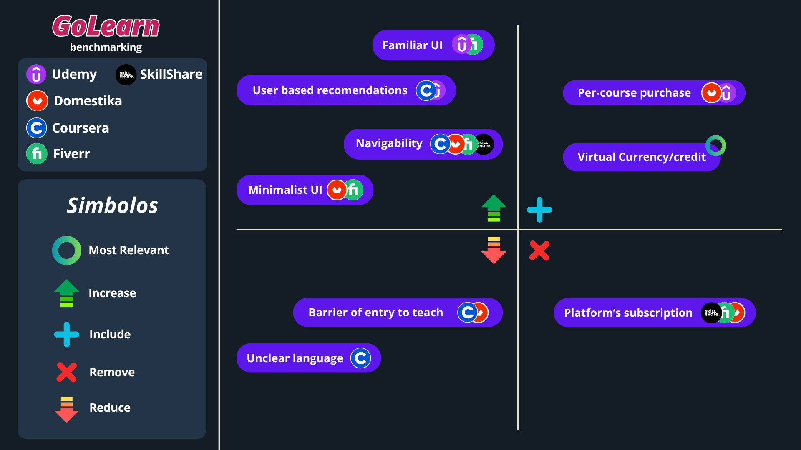

# GoLearn
## Table of Contents
1. [Introduction](#1-introduction)  
   1.1. [The Problem](#11-the-problem)  
   1.2. [The Solution](#12-the-solution)   
   1.3. [GoLearn](#13-golearn)
2. [Team & Roles](#3-team--roles)
3. [Strategy](#4-strategy)  
   3.1. [Value Proposition Canvas](#31-value-proposition-canvas)  
   3.2. [UX Personas](#32-ux-personas)  
   3.3. [Benchmarking](#33-benchmarking)
4. [Scope](#scope)  
   4.1. [Customer Journey Map](#41-customer-journey-map)  
   4.1.1. [Decision Stage Interfaces](#411-decision-stage-interfaces)
5. [Structure](#5-structure)  
   5.1. [Navigation Flow](#51-navigation-flow)
6. [Skeleton](#6-skeleton)  
   6.1. [Low-Fidelity Wireframes](#61-low-fidelity-wireframes)
7. [Surface](#7-surface)  
   7.1. [Interface Evolution](#71-interface-evolution)  
   7.2. [Results of the Heuristic Evaluation](#72-results-of-the-heuristic-evaluation)  
   7.3. [High-Definition Interfaces](#73-high-definition-interfaces)

---

## 1. Introduction

### 1.1. The Problem
Many people possess valuable knowledge and skills (such as cooking, basic repairs, music, design, handcrafts, languages, and so on), but they do not have the platform to share it without being certified experts or part of teaching institutions.
At the same time, there’s a growing number of people interested in learning from practical experience, with a closer, more flexible, and more economic view compared to traditional courses.
Modern platforms tend to impose subscription models, high costs, or a focus on traditional academic content, which leaves behind the people who search for a space more open to community, flexibility, and practicality.

### 1.2. The Solution
A marketplace platform for skill sharing and community courses, where:
- Any user can create and offer courses based on their skills
- Students can get access to courses using a credit system, which can be earned through offering courses or paying money.
- Teachers can cash in their credits for money if they become app affiliates.
- Trust is fostered through community reviews and ratings.
- The complexity of subscription models is avoided, giving way to a fairer, more flexible system.

### 1.3 GoLearn

GoLearn is more than just an app; it is a community that empowers people to learn from real experiences and sharing their knowledge, regardless of formal credentials

We believe in democratizing education and making practical skills accessible and rewarding for everyone 

***GoLearn**: Knowledge for everyone, shared by everyone*

## 2. Team & Roles

- Cristobal Cheuquel, Project Manager
- Valentina Huenchuñir, Designer
- Nicole Rodríguez, Presenter
- Millarayen Ferrada, Analyst

## 3. Strategy

### 3.1. Value Proposition Canvas

The Value Proposition Canvas illustrates how GoLearn connects its offering with the real needs and aspirations of its users, creating a balance between what learners seek and what the platform delivers

#### Customer Segments

Our main users are individuals eager to learn and teach practical skills in a flexible, community-driven environment.

#### Value Proposition

GoLearn offers a marketplace for community-based learning, empowering users to both teach and learn in a fair, accessible ecosystem.

### 3.2. UX Personas

Through interviews and surveys with college students, we landed on these personas which represent the different realities behind GoLearn

#### Carolina Vargas
> “I want to earn money doing what I love, leveraging my existing social media audience”

#### Sofia Martinez
> “I want to pick up new skills for fun and personal enrichment, without having to invest large amounts of money”

#### Camila Castro
> “I want to showcase my skills in a practical way, and generate additional income along the way”

### 3.3. Benchmarking

In order to develop an app which meets the needs and wants of our users, we analyzed other platforms currently available, in order to figure out what works and what doesn't from them.
For this, we selected five other skill sharing platforms: Udemy, Domestika, SkillShare, Coursera and Fiverr

## 4. Scope

### 4.1 Customer Journey Map

We’ve identified five key stages in the customer’s journey with GoLearn

- Awareness
- Consideration
- Decision
- Service
- Loyalty and Advocacy

These stages can be seen explained in detail down below

#### 4.1.1 Decision Stage Interfaces

placeholder

## 5. Structure

### 5.1. Navigation Flow

The navigation flow illustrates how users move through the GoLearn platform, from discovering courses to offering their own. It ensures a smooth and intuitive experience for both learners and teachers.

- **Landing Page:** Users can explore featured courses, see popular categories, and log in or sign up.
- **User Dashboard:** After logging in, users access their dashboard, showing their enrolled courses, available credits, and progress.
- **Course Browsing:** Users can search and filter courses by category, popularity, or skill level.
- **Course Details:** Each course page displays the curriculum, teacher information, reviews, and the option to enroll using credits.
- **Creating a Course:** Users who want to teach can access a guided course creation flow with templates and tips.
- **Credits & Payments:** Users can view, earn, or spend credits; teachers can request payouts if they are affiliates.
- **Community & Reviews:** Users can rate courses, leave feedback, and interact with other learners to foster trust.
- **Settings & Profile:** Users can update personal information, manage notifications, and view their activity history.

This flow is designed to make the platform intuitive, flexible, and community-oriented, minimizing friction while maximizing engagement.

PLACEHOLDER

## 6. Skeleton

### 6.1. Low-Fidelity Wireframes

To define the structure and layout of the platform, we created low-fidelity wireframes that outline the main navigation flow, core screens, and interaction logic of GoLearn. They serve as the foundation for the next visual and interaction design decisions.

You can explore them through the following links:

- **Figma Prototype PLACEHOLDER:** [View in Figma](https://www.figma.com/file/YOUR-FIGMA-LINK)
- **Wireframes PDF:** [Go to PDF](./docs/wireframes-GoLearn.pdf)

## 7. Surface

### 7.1. Interface Evolution

### 7.2. Results of the Heuristic Evaluation

### 7.3. High-Definition Interfaces